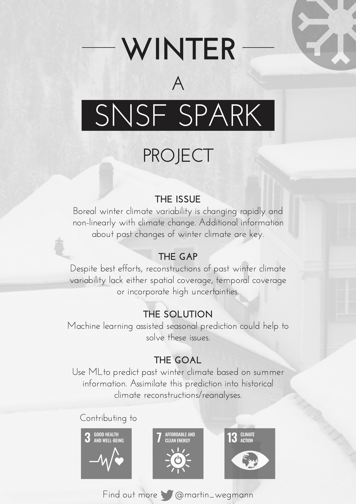

# Martin Wegmann
### Curriculum Vitae

***

## Proficiency & Research Interests

My early research was on the effect of volcanic eruptions on climate during the last 400 years. I investigated the impact of explosive eruptions, such as Tambora in 1815, in general circulation models as examples of extreme external forcing. 

Since then, I've been working more on the evolution of Arctic and high- to mid-latitude climates over the last 150 years. I combine in-situ, proxy, reanalysis and model data to try to untangle puzzling features and questions. I focus especially on the changing cryosphere and its impact on atmospheric circulation patterns. This includes analysing processes ranging from daily to decadal, and from regional to hemispheric resolution. Recently, I shifted my focus a little bit to seasonal prediction, combining my background of teleconnections, climate forcings and cryosphere-atmosphere feedbacks. 

After working for the WMO to coordinate weather and climate research projects, I am currently a Swiss National Science Foundation supported researcher at the University of Bern, trying to combine historical climate reconstructions with seasonal climate prediction ideas by using machine learning tools.

Besides these scientific foci, I am highly interested in graphic and communication design. In some instances I am able to combine this interest with professional matters, such as talks, posters or figures. I often wonder about how to deliver (my) messages visually, dwelve into graphic design magazines and look out for new font types or color palettes. 

<!-- I worked here: https://www.nature.com/articles/d41586-019-01928-7?fbclid=IwAR3qC2vbYGTpQEucHxpWZeRcQzIYwmVloUIBqnOktFUdt89kOOUv4xIPN9k -->

***

## Education & Experience

* **SNSF Funded Researcher**
    + [Oeschger Centre for Climate Change Research](http://www.oeschger.unibe.ch)
    + University of Bern
    + 2020 - present

* **Junior Professional Officer**
    + [World Weather Research Division](https://community.wmo.int/activity-areas/wwrp)
    + World Meteorological Organization, United Nations, Geneva
    + 2019 - 2020

* **PostDoc**
    + [Paleoclimate Dynamics, Climate Science Division](https://www.awi.de/en/science/climate-sciences/paleoclimate-dynamics.html)
    + Alfred Wegener Institute, Helmholtz Centre for Polar and Marine Research, Bremerhaven
    + 2018 - 2019  

* **PostDoc**
    + [Institute for Environmental Geosciences (formerly LGGE, now IGE)](http://www.ige-grenoble.fr/?lang=en)
    + University of Grenoble
    + 2016 - 2017    
    
    
* **PhD**
    + [Oeschger Centre for Climate Change Research](http://www.oeschger.unibe.ch)
    + University of Bern
    + 2012 - 2015  
    
* **Master of Science**
    + [Oeschger Centre for Climate Change Research](http://www.oeschger.unibe.ch)
    + University of Bern
    + 2010 - 2012  
    
    
* **Student Assistant**
    + [Institute of Geography, Climatology Group](http://www.geography.unibe.ch/research/climatology_group/index_eng.html)
    + University of Bern
    + 2011 - 2012  
    
* **Bachelor of Science**
    + [Geography](https://www.geographie.ruhr-uni-bochum.de/news/)
    + Ruhr University Bochum
    + 2006 - 2009  
    
    
* **Student Assistant**
    + [Leibniz Institute of Economics Research (RWI), Essen](https://en.rwi-essen.de)
    + 2009 - 2010  

***

## Peer Reviewed Publications

* **Wegmann, M.** & Jaume-Santero, F. (2022). Artificial intelligence achieves fast, global temperature reconstructions via minimal local data. `Submitted: Nature Communications`

* Thoele, L., Ai, X., Auderset, A., Schmitt, M., Moretti, S., Studer, A., Michel, E., **Wegmann, M.**, Mazaud, A., Bijl, P., Sigman, D., Martinez-Garcia, A. & Jaccard, S. (2022). Migration of the Antarctic Polar Front over the last glacial cycle. `In Review: Nature Communications`

* Dufour, A., **Wegmann, M.**, Zolina, O. & Gulev, S. (2022). Evidence of water cycle intensification over Siberia from a joint analysis of moisture transport and land hydrology. `In Review: Environmental Research Letters`

* [Sasgen, I., Salles, A., **Wegmann, M.**, Wouters, B., Fettweis, X., Noel, B. & Beck, C. (2022). Arctic glaciers record wavier circumpolar winds. Nat. Clim. Chang. 12, 249–255.](https://www.nature.com/articles/s41558-021-01275-4)

* [**Wegmann, M.**, Orsolini, Y., Weisheimer, A., Van den Hurk, B., & Lohmann, G. (2021). Impact of Eurasian autumn snow on the winter North Atlantic Oscillation in seasonal forecasts of the 20th century. Weather Clim. Dynam., 2, 1245-1261.](https://wcd.copernicus.org/articles/2/1245/2021/)

* [Balting, D., Ionita, M., **Wegmann, M.**,  Helle, G., Schleser, G., Rimbu, N., Freund, M., Heinrich, I., Caldarescu, D. & Lohmann, G. (2021). Large-scale climate signals of a European oxygen isotope network from tree rings. Clim. Past, 17, 1005-1023.](https://cp.copernicus.org/articles/17/1005/2021/)

* [**Wegmann, M.**, Rohrer, M., Santolaria-Otin, M.  & Lohmann, G. (2020). Eurasian autumn snow link to winter North Atlantic Oscillation strongest for Arctic warming periods. Earth Syst. Dynam., 11, 509-524.](https://esd.copernicus.org/articles/11/509/2020/)

* [Orsolini, Y., **Wegmann, M.**, Dutra, E., Liu, B., Balsamo, G., Yang, K., de Rosnay, P., Zhu, C., Wang, W., & Senan, R. (2019). Evaluation of snow depth and snow-cover over the Tibetan Plateau in global reanalyses using in-situ and satellite remote sensing observations. The Cryosphere, 13, 2221-2239.](https://www.the-cryosphere.net/13/2221/2019/)

* [**Wegmann, M.**, Dutra, E., Jacobi, H.W. & Zolina, O. (2018). Spring snow albedo feedback over Northern Eurasia: Comparing in-situ measurements with reanalysis products. The Cryosphere, 12(6), 1887-1898](https://www.the-cryosphere.net/12/1887/2018/tc-12-1887-2018.html)

* [**Wegmann, M.**, Orsolini, Y. & Zolina, O. (2018). Warm Arctic - cold Siberia: comparing the recent and the early 20th-century Arctic warmings. Environmental Research Letters, 13, 025009.  ](http://iopscience.iop.org/article/10.1088/1748-9326/aaa0b7/meta)

* [**Wegmann, M.**, Orsolini, Y., Dutra, E., Bulygina, O., Sterin, A. & Broennimann, S. (2017). Eurasian snow depth in long-term climate reanalyses. The Cryosphere, 11(2), 923-935. ](https://www.the-cryosphere.net/11/923/2017/)

* [**Wegmann, M.**, Broennimann, S. & Compo, G.P. (2017). Tropospheric circulation during the early twentieth century Arctic warming. Climate Dynamics, 48, 2405.  ](https://link.springer.com/article/10.1007/s00382-016-3212-6)

* [Broennimann, S., Malik, A., Stickler, A., **Wegmann, M.**, Raible, C. C., Muthers, ... & Schmutz, W. (2016). Multidecadal variations of the effects of the Quasi-Biennial Oscillation on the climate system. Atmos. Chem. Phys., 16, 15529-15543.](https://www.atmos-chem-phys.net/16/15529/2016/acp-16-15529-2016.html)

* [Raible, C. C., Broennimann, S., Auchmann, R., Brohan, P., Froelicher, T. L., Graf, ... & **Wegmann, M.** (2016). Tambora 1815 as a test case for high impact volcanic eruptions. Earth system effects. WIREs Clim Change, 7, 569-589.](http://wires.wiley.com/WileyCDA/WiresArticle/wisId-WCC407.html)

* [**Wegmann, M.**, Orsolini, Y., Vazquez, M., Gimeno, L., Nieto, R., Bulygina, O., ... & Broennimann, S. (2015). Arctic moisture source for Eurasian snow cover variations in autumn. Environmental Research Letters, 10(5), 054015.](http://iopscience.iop.org/article/10.1088/1748-9326/10/5/054015/meta)

* [**Wegmann, M.**, Broennimann, S., Bhend, J., Franke, J., Folini, D., Wild, M., & Luterbacher, J. (2014). Volcanic Influence on European Summer Precipitation through Monsoons: Possible Cause for Years without Summer. Journal of Climate, 27(10), 3683-3691.](https://journals.ametsoc.org/doi/full/10.1175/JCLI-D-13-00524.1)

* [Auchmann, R., Arfeuille, F., **Wegmann, M.**, Franke, J., Barriendos, M., Prohom, M., ... & Broennimann, S. (2013). Impact of volcanic stratospheric aerosols on diurnal temperature range in Europe over the past 200 years: Observations versus model simulations. Journal of Geophysical Research: Atmospheres, 118(16), 9064-9077.](https://agupubs.onlinelibrary.wiley.com/doi/abs/10.1002/jgrd.50759)

***

## Secured Funding

* [**2020 SNF SPARK Call**](http://www.snf.ch/en/researchinFocus/newsroom/Pages/news-200911-spark-in-high-demand-again.aspx)
    + WINTER: Winter Climate Prediction with Machine Learning
 

***
